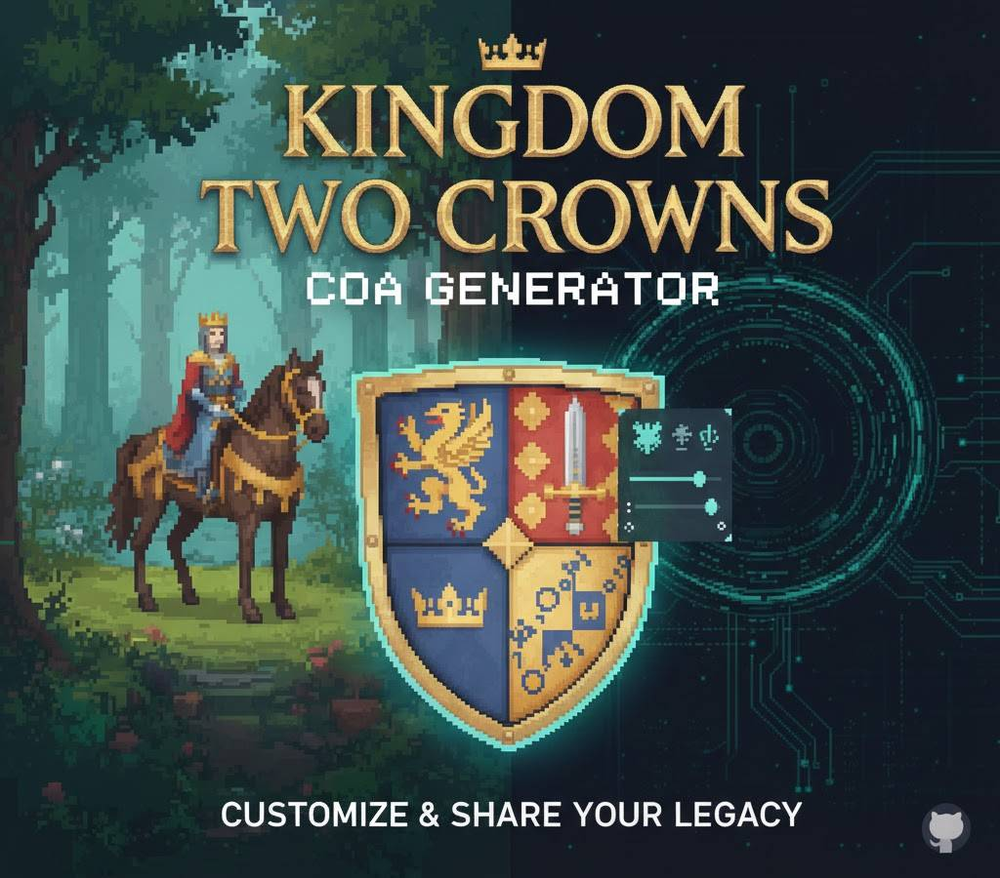

# Kingdom Two Crowns Coat of Arms Generator

> Outil de génération et de prévisualisation des blasons (Coat of Arms) pour Kingdom Two Crowns. Optimisé pour la précision historique et esthétique des bannières.

---

## 🛡️ Fonctionnalités

* **Génération Procédurale** : Création de combinaisons de blasons valides selon les assets du jeu.
* **Aperçu Temps Réel** : Rendu visuel immédiat des motifs, couleurs et emblèmes.
* **Export Direct** : Récupération des codes de configuration pour les fichiers de sauvegarde ou serveurs.
* **Base de données complète** : Inclut tous les patterns (animaux, formes géométriques, symboles spéciaux).

[](https://twitter.com/i/status/1074481246833647616)

## 🚀 Installation

### Prérequis

* .NET 8.0 Runtime (ou version supérieure)

### Setup

```bash
git clone https://github.com/Mister-Wolfgang/kingdom-two-crowns-coa-generator.git
cd kingdom-two-crowns-coa-generator
dotnet run

```

## 🛠 Usage

1. Sélectionnez les éléments de base (fond, couleur 1, couleur 2).
2. Choisissez l'emblème central parmi la liste des sprites officiels.
3. Copiez la chaîne de caractères générée.
4. Collez-la dans votre fichier de configuration de jeu.

## 📁 Structure du Projet

* `/Assets` : Sprites et ressources graphiques du jeu.
* `/Generator` : Logique de traitement des images et des patterns.
* `/UI` : Interface utilisateur (C#).

---

### Section About (GitHub Page)

**Description (Tagline) :**

> Efficient Coat of Arms generator and visualizer for Kingdom Two Crowns. Create, preview, and export custom banner codes.

**Topics (Tags) :**
`kingdom-two-crowns` `coa-generator` `csharp` `pixel-art` `game-tool` `banner-editor` `procedural-generation`

**Website :**
`https://github.com/Mister-Wolfgang/claude-code-shinra-marketplace` (ou lien vers la release)

---
